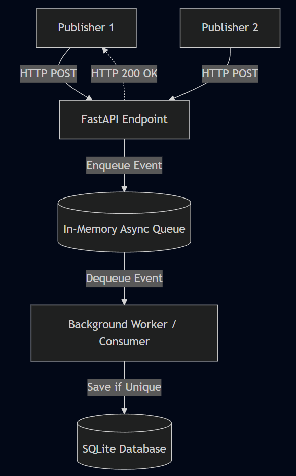

# Laporan Analisis Sistem: Event Aggregator

## 1. Ringkasan Sistem dan Arsitektur

Sistem _Event Aggregator_ adalah layanan berbasis REST API asinkron (dibangun menggunakan FastAPI) yang dirancang untuk menerima, memvalidasi, dan mengagregasi event data bervolume tinggi dari berbagai _source_ (publisher). Sistem memisahkan lapisan penerimaan pesan dengan penyimpanan data demi mempertahankan _throughput_ penerimaan yang sangat cepat.

**Diagram Sederhana (Arsitektur Internal):**

## 2. Keputusan Desain

- **Idempotency**: Aplikasi beroperasi sebagai _idempotent consumer_. Hal ini sangat esensial dalam sistem terdistribusi. Jika _publisher_ mengalami _timeout_ parsial dan mencoba mengirim ulang data yang sama, aggregator tidak akan merusak status data (_state_ tetap sama seperti dikirim sekali).
- **Dedup Store**: Deduplikasi dilakukan dengan strict di lapisan _database_. Tabel SQLite memiliki _composite primary key_ pada kolom `(topic, event_id)`. Segala upaya untuk menyisipkan kombinasi yang sama otomatis ditolak (_IntegrityError_) dan dicatat secara aman sebagai _duplicate_dropped_.
- **Ordering**: Sistem menganut pendekatan _unordered processing_. Mengingat event dipublikasikan secara asinkron dari berbagai mesin, memaksakan _strict total ordering_ justru akan menyebabkan _bottleneck_. Pemrosesan dilakukan sesuai urutan kedatangan antrean (_FIFO_ dari antrean).
- **Retry**: Sistem melepaskan tanggung jawab pengulangan pengiriman kepada pengirim (_At-Least-Once Delivery_). Aggregator menjamin ketersediaan menerima _retry_ dengan mengandalkan mekanisme deduplikasi yang kuat.

## 3. Analisis Performa dan Metrik

Desain _producer-consumer_ melalui Memory Queue menghasilkan kelebihan dan tantangan performa:

- **Throughput Tinggi pada API**: Endpoint HTTP memindahkan data ke RAM (`asyncio.Queue`) secara konstan lalu mengembalikan sinyal sukses. Hal ini menghindari efek pemblokiran antrean I/O diska lokal.
- **Titik Penumpukan (Bottleneck)**: Kinerja _background worker_ database yang tunggal adalah titik terlemah. Jika laju pesan lebih masif dari kecepatan _commit_ SQLite, _queue_ di memori RAM akan membengkak, meningkatkan ancaman kebocoran memori (OOM).
- **Metrik Obeservabilitas**: API terekspos untuk `/stats` sehingga performa dapat diamati langsung lewat `received`, `unique_processed`, dan `duplicate_dropped`.

## 4. Keterkaitan ke Bab 1–7

_(Berdasarkan konsep umum Sistem Terdistribusi. Silakan rujuk kembali dengan buku pegangan yang relevan)_

- **Bab 1 (Karakteristik & Tujuan Sistem)**: _Event Aggregator_ menunjukkan sifat utama sistem terdistribusi, yakni menangani konkurensi antar-_publisher_ mandiri serta memisahkan komponen klien-server lewat komunikasi jaringan transien.
- **Bab 2 (Arsitektur)**: Sistem mengimplementasikan gabungan pola arsitektur _Client-Server_ pada eksternal dan pola _Producer-Consumer_ pada internal untuk menyembunyikan latensi operasi I/O.
- **Bab 3 (Proses)**: Pemanfaatan _coroutine_ bawaan Python (`asyncio`) memungkinkan server melayani ribuan koneksi konkuren melalui _event-loop_ tanpa _overhead_ pembuat _thread_ OS konvensional.
- **Bab 4 (Komunikasi)**: _Publisher_ menggunakan antarmuka protokol RPC asinkron (berbasis antarmuka HTTP REST) di mana pengirim dapat langsung melakukan iterasi pengiriman selanjutnya setelah respons sukses diterima.
- **Bab 5 (Penamaan)**: Resolusi dan identifikasi data menggunakan _flat naming_ via pembuatan UUID independen di pihak _publisher_ (kolom `event_id`) demi menghindari tabrakan ID sentral.
- **Bab 6 (Sinkronisasi)**: Sinkronisasi waktu antar node dihindari. _Timestamp_ dikumpulkan dari waktu absolut masing-masing _publisher_ secara independen demi menoleransi hambatan pengurutan fisik (_clock skew_).
- **Bab 7 (Konsistensi & Replikasi)**: Konsistensi data dalam kasus interaksi komponen dipertahankan melalui strategi keandalan pesan berbasis deduplikasi untuk menjamin jaminan semantik pengiriman _At-Least-Once Delivery_.

## 5. Pengujian dan Validasi (Unit Testing)

Untuk menjamin keandalan sistem terdistribusi, serangkaian _unit test_ otomatis (menggunakan kerangka kerja `pytest`) telah diimplementasikan di dalam proyek ini. Pengujian difokuskan pada pengecekan persistensi deduplikasi, keketatan struktur data, serta ketahanan beban (_stress test_).

Berikut adalah ringkasan penjelasan setiap fungsi tes beserta hasilnya:

| Nama Pengujian                                     | Tujuan Pengujian                                                                                                                                                                     | Status Hasil |
| :------------------------------------------------- | :----------------------------------------------------------------------------------------------------------------------------------------------------------------------------------- | :----------- |
| `test_deduplication_validation`                    | Memastikan _event_ ganda dengan kombinasi `topic` dan `event_id` yang sama berhasil ditolak secara otomatis oleh sistem.                                                             | PASS         |
| `test_deduplication_persistence_simulated_restart` | Mensimulasikan _shutdown_ dan _startup_ server untuk membuktikan bahwa fitur deduplikasi bersandar pada penyimpanan disk permanen (SQLite), bukan memori yang hilang saat _restart_. | PASS         |
| `test_event_schema_validation`                     | Menjamin ketegasan skema API; aplikasi akan secara proaktif menolak _payload_ yang tidak lengkap (misal tanpa _timestamp_) dengan _error_ HTTP 422.                                  | PASS         |
| `test_get_events_and_stats_consistency`            | Mengirim campuran pengiriman _batch_ (unik dan duplikat) untuk memverifikasi bahwa endpoint `/stats` melakukan kalkulasi JSON yang tepat matematis.                                  | PASS         |
| `test_stress_small_scale`                          | Melakukan simulasi _stress test_ kecil (100 event) guna memastikan siklus antrean _producer-consumer_ tidak mogok (_hang_) ketika dihujani request yang berdekatan.                  | PASS         |

## Video Demo

https://www.youtube.com/watch?v=-KNiM8cA0AE

## Referensi

Van Steen, M., & Tanenbaum, A. S. (2023). Distributed systems (4th ed.). Maarten van Steen. https://www.distributed-systems.net/
